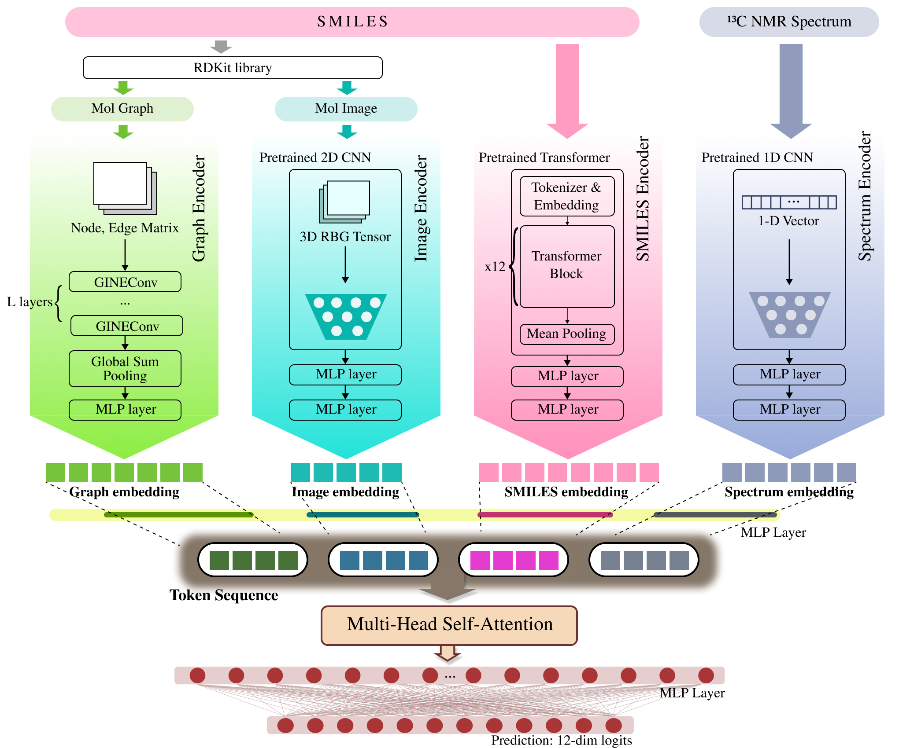

# MoltiTox: a multimodal fusion model for molecular toxicity prediction

**Status:** Accepted in *Frontiers in Toxicology* (awaiting publication)

**Citation and DOI:** Will be available upon publication

A comprehensive deep learning model for molecular toxicity prediction using single and multimodal approaches. The model combines molecular graphs, SMILES sequences, 2D structure images, and NMR spectra to predict toxicity across 12 different endpoints from the Tox21 dataset.

## Table of Contents
- [Overview](#overview)
- [Features](#features)
- [Project Structure](#project-structure)
- [Model Architecture](#model-architecture)
- [Installation](#installation)
- [Data Download](#data-download)
- [Data Preprocessing](#data-preprocessing)
- [Usage](#usage)
- [Results](#results)
- [References](#references)

## Overview

This model leverages pre-trained molecular encoders and multimodal fusion for toxicity prediction, achieving superior performance compared to single-modal baselines on the Tox21 benchmark.



It supports:
- **4 Single-Modal Encoders**: Graph (GNN), SMILES (Transformer), Image (CNN), Spectrum (1D CNN)
- **8 Multimodal Fusion Models**: All pairwise and higher-order combinations of the modalities
- **12 Toxicity Endpoints**: NR-AR, NR-AR-LBD, NR-AhR, NR-Aromatase, NR-ER, NR-ER-LBD, NR-PPAR-gamma, SR-ARE, SR-ATAD5, SR-HSE, SR-MMP, SR-p53

The multimodal models use self-attention fusion mechanisms to effectively combine complementary information from different molecular representations.

## Features

- **Automated Hyperparameter Tuning**: Optuna-based TPE optimization
- **Two-Stage Training**: Train/valid split optimization → Full dataset retraining
- **Pre-trained Backbones**:
  - MoLFormer-XL for SMILES encoding
  - ImageMol (ResNet18) for image encoding
  - CReSS for NMR spectrum encoding
- **Multi-Task Learning**: Simultaneous prediction of 12 toxicity endpoints

## Project Structure

```
my_model/
├── models/
│   ├── models.py              # All encoder and classifier models
│   └── __init__.py
├── utils/
│   ├── dataset.py             # Dataset classes for all modalities
│   └── __init__.py
├── experiments/
│   ├── graph/                 # Graph-based experiments
│   │   ├── train.py
│   │   └── test.py
│   ├── smiles/                # SMILES-based experiments
│   │   ├── train.py
│   │   └── test.py
│   ├── image/                 # Image-based experiments
│   │   ├── train.py
│   │   └── test.py
│   ├── spectrum/              # Spectrum-based experiments
│   │   ├── train.py
│   │   ├── test.py
│   │   └── CReSS/             # CReSS model for NMR encoding
│   └── multimodal/            # Multimodal fusion experiments
│       ├── gph_smi/           # Graph + SMILES
│       ├── gph_img/           # Graph + Image
│       ├── gph_spec/          # Graph + Spectrum
│       ├── smi_img/           # SMILES + Image
│       ├── smi_spec/          # SMILES + Spectrum
│       ├── spec_img/          # Spectrum + Image
│       ├── gph_smi_img/       # Graph + SMILES + Image
│       └── moltitox/          # Graph + SMILES + Image + Spectrum (Full)
├── data/
│   ├── train.csv              # Training data
│   ├── valid.csv              # Validation data
│   ├── test.csv               # Test data
│   ├── train_spectra.csv      # Training data with spectra
│   ├── valid_spectra.csv      # Validation data with spectra
│   ├── test_spectra.csv       # Test data with spectra
│   ├── images/                # Molecular 2D structure images
│   └── spectra/               # NMR spectral data (.npy files)
├── checkpoints/
│   ├── encoder/               # Saved encoder weights
│   │   ├── train_only/        # Encoders trained on train set only
│   │   └── train_and_valid/   # Encoders trained on train+valid
│   ├── model/                 # Saved full model weights
│   ├── parameters/            # Best hyperparameters (JSON)
│   └── pretrained_models/     # Pre-trained model checkpoints
├── main.py                    # Run all experiments sequentially
├── requirements.txt           # Python dependencies
└── README.md                  # This file
```

## Model Architecture

### Single-Modal Encoders

1. **GraphEncoder** (`models.models.GraphEncoder`)
   - Architecture: Graph Isomorphism Network (GIN) with GINEConv layers
   - Input: Molecular graph with node features (78-dim) and edge features (4-dim)
   - Layers: Multiple GINEConv → BatchNorm → ReLU → Dropout

2. **SMILESEncoder** (`models.models.SMILESEncoder`)
   - Architecture: Pre-trained MoLFormer-XL transformer
   - Input: Tokenized SMILES strings (max length: 202)
   - Layers: Transformer encoder + 2-layer MLP

3. **ImageEncoder** (`models.models.ImageEncoder`)
   - Architecture: Pre-trained ResNet18 (ImageMol)
   - Input: 224×224 RGB images of 2D molecular structures
   - Layers: ResNet18 backbone + 2-layer MLP

4. **SpectrumEncoder** (`models.models.SpectrumEncoder`)
   - Architecture: Pre-trained CReSS NMR encoder
   - Input: List of PPM values from ¹³C NMR spectra
   - Layers: 1D CNN encoder + 2-layer MLP

### Multimodal Fusion Models

All multimodal models follow a unified architecture:
1. **Projection**: Project each modality embedding to common dimension
2. **Fusion**: Multi-head self-attention over modality tokens
3. **Pooling**: Mean pooling across modality dimension
4. **Classification**: MLP head for multi-task prediction

Available fusion models:
- `MultiModalGphSMI`: Graph + SMILES
- `MultiModalGphImg`: Graph + Image
- `MultiModalGphSpec`: Graph + Spectrum
- `MultiModalSMIImg`: SMILES + Image
- `MultiModalSMISpec`: SMILES + Spectrum
- `MultiModalSpecImg`: Spectrum + Image
- `MultiModalGphSMIImg`: Graph + SMILES + Image
- `MoltiTox`: Graph + SMILES + Image + Spectrum (Full)

### Loss Function

Binary cross-entropy with logits, masked for missing labels:
```python
mask = (labels >= 0).float()
targets = labels.clamp(min=0)
per_sample_loss = F.binary_cross_entropy_with_logits(logits, targets, reduction="none")
loss = (per_sample_loss * mask).sum() / mask.sum()
```

## Installation

### Requirements
- Python 3.8+
- PyTorch 1.12+
- PyTorch Geometric
- Transformers (Hugging Face)
- RDKit
- scikit-learn
- optuna
- pandas
- numpy
- PIL

### Setup

```bash
# Clone the repository
git clone https://github.com/skku-aihclab/proj25-molecule-toxicity-prediction.git
cd proj25-molecule-toxicity-prediction

# Install dependencies
pip install -r requirements.txt
```

See the [Data Download](#data-download) section below for downloading datasets and pre-trained models.

## Data Download

All required data files, pre-trained models, and checkpoints are available on Google Drive:

**Google Drive Link:** https://drive.google.com/drive/folders/13QLMfp9T_C8tiHabWEwB1knieR9ZOZO9?usp=drive_link

### Directory Structure on Google Drive

```
MoltiTox/
├── data/
│   ├── 1st/
│   │   ├── train.csv
│   │   ├── valid.csv
│   │   ├── test.csv
│   │   ├── train_spectra.csv
│   │   ├── valid_spectra.csv
│   │   └── test_spectra.csv
│   ├── 2nd/
│   │   └── [same structure]
│   ├── 3rd/
│   │   └── [same structure]
│   ├── 4th/
│   │   └── [same structure]
│   └── 5th/
│       └── [same structure]
├── checkpoints/
│   ├── 1st/
│   │   ├── encoder/
│   │   ├── model/
│   │   └── parameters/
│   ├── 2nd/
│   │   └── [same structure]
│   ├── 3rd/
│   │   └── [same structure]
│   ├── 4th/
│   │   └── [same structure]
│   └── 5th/
│       └── [same structure]
├── ImageMol.pth
└── 8.pth
```

### Download Instructions

1. **Download Dataset**
   Images and spectra are included in this repository.
   
   However, if you want to use the same data splits as reported in the paper, download the CSV files from Google Drive:
   - Navigate to the `data/` folder on Google Drive
   - Choose one of the 5 splits (1st through 5th)
   - Download all 6 CSV files:
     - `train.csv`, `valid.csv`, `test.csv` (full datasets)
     - `train_spectra.csv`, `valid_spectra.csv`, `test_spectra.csv` (spectra subset only)
   - Place the downloaded CSV files in your local `data/` directory

2. **Download Pre-trained Checkpoints (Optional)**
   - Navigate to the `checkpoints/` folder on Google Drive
   - Choose the corresponding split (1st through 5th) that matches your data
   - Download the entire folder structure (`encoder/`, `model/`, `parameters/`)
   - Place the downloaded folders in your local `checkpoints/` directory
   - The checkpoint structure must match the original:
     ```
     checkpoints/
     ├── encoder/
     │   ├── train_only/
     │   └── train_and_valid/
     ├── model/
     └── parameters/
     ```

3. **Download Pre-trained Backbones**
   - Download `ImageMol.pth` from the Google Drive root
   - Place it in `experiments/image/ImageMol.pth`
   - Download `8.pth` from the Google Drive root
   - Place it in `experiments/spectrum/8.pth`

### Data File Descriptions

- **Standard CSV files** (`train.csv`, `valid.csv`, `test.csv`):
  - Contains all molecules with graph, SMILES, and image modalities
  - Used for single-modal (graph, SMILES, image) and multimodal experiments without spectra

- **Spectra CSV files** (`train_spectra.csv`, `valid_spectra.csv`, `test_spectra.csv`):
  - Contains only molecules with available NMR spectra
  - Subset of the standard datasets
  - Used for spectrum-based and spectrum-inclusive multimodal experiments

### About the Data Splits

The dataset is provided in 5 different random splits (1st through 5th) to ensure robust evaluation and reproducibility. Each split maintains the same train/valid/test distribution but with different random assignments.

## Data Preprocessing

The preprocessing pipeline for the Tox21 dataset is documented in `data/preprocess.ipynb`. This notebook demonstrates:

1. **Molecular Structure Processing**
   - Filtering molecules for RDKit compatibility
   - Converting SMILES to InChIKeys for database matching
   - Generating 224×224 PNG images from molecular structures

2. **NMR Spectral Data Collection**
   - Matching Tox21 molecules with ¹³C NMR spectra from three databases:
     - **NMRShiftDB2**: Public NMR database
     - **NP-MRD**: Natural Products Magnetic Resonance Database
     - **HMDB**: Human Metabolome Database
   - Converting spectral data to 4000-dimensional binary vectors (0.1 ppm resolution, -50 to 350 ppm range)
   - Saving processed spectra as `.npy` files

3. **Dataset Splitting**
   - Scaffold-based splitting to ensure structural diversity across train/valid/test sets
   - Creating spectra-specific subsets for spectrum-inclusive experiments

### Running the Preprocessing Pipeline

**Note:** The preprocessing notebook requires access to the original spectral databases (NMRShiftDB2, NP-MRD, HMDB). These databases are not included in this repository due to licensing and size constraints.

If you wish to reproduce the preprocessing pipeline or need access to the raw spectral databases, please contact me.

The pre-processed data (CSV files, images, and binary spectra) are already available and can be used directly without running the preprocessing pipeline.

## Usage

### Running All Experiments

To run all experiments sequentially (single-modal + multimodal):

```bash
python -u main.py 2>&1 | tee result.txt
```

This will:
1. Train and test all 4 single-modal models
2. Train and test all 8 multimodal models
3. Save all results to `result.txt`
4. Save model checkpoints to `checkpoints/`
5. Save best hyperparameters to `checkpoints/parameters/`

### Running Individual Experiments

To run a specific experiment:

```bash
# Single-modal examples
cd experiments/graph
python train.py  # Train graph model
python test.py   # Test graph model

cd ../smiles
python train.py  # Train SMILES model
python test.py   # Test SMILES model

# Multimodal examples
cd ../multimodal/gph_smi
python train.py  # Train Graph+SMILES fusion model
python test.py   # Test Graph+SMILES fusion model

cd ../smi_img
python train.py  # Train SMILES+Image fusion model
python test.py   # Test SMILES+Image fusion model
```

### Training Pipeline

Each training script follows this pipeline:

1. **Load Data**
2. **Load Encoders**
3. **Hyperparameter Search**
4. **Save Best Parameters**
5. **Retrain on Full Data**

### Testing Pipeline

Each testing script:
1. Loads test data
2. Loads best hyperparameters
3. Loads trained model checkpoint
4. Evaluates on test set
5. Reports per-task AUC and mean AUC


## Results

The model generates results for 12 Tox21 toxicity endpoints:

| Endpoint | Description |
|----------|-------------|
| NR-AR | Nuclear Receptor - Androgen Receptor |
| NR-AR-LBD | NR-AR Ligand Binding Domain |
| NR-AhR | Nuclear Receptor - Aryl Hydrocarbon Receptor |
| NR-Aromatase | Nuclear Receptor - Aromatase |
| NR-ER | Nuclear Receptor - Estrogen Receptor |
| NR-ER-LBD | NR-ER Ligand Binding Domain |
| NR-PPAR-gamma | NR - Peroxisome Proliferator-Activated Receptor Gamma |
| SR-ARE | Stress Response - Antioxidant Response Element |
| SR-ATAD5 | Stress Response - ATAD5 |
| SR-HSE | Stress Response - Heat Shock Element |
| SR-MMP | Stress Response - Mitochondrial Membrane Potential |
| SR-p53 | Stress Response - p53 |

Results are reported as ROC-AUC scores for each endpoint and mean AUC across all endpoints.


## File Descriptions

### Core Model Files

- **`models/models.py`**: Contains all encoder and classifier implementations
  - Single-modal: GraphEncoder, SMILESEncoder, ImageEncoder, SpectrumEncoder
  - Classifiers: GraphClassifier, SMILESClassifier, ImageClassifier, SpectrumClassifier
  - Multimodal: All fusion model classes

- **`utils/dataset.py`**: Dataset classes for loading and preprocessing
  - Single-modal: GraphDataset, SMILESDataset, ImageDataset, SpectrumDataset
  - Multimodal: GraphSMILESDataset, GraphImageDataset, etc.

### Checkpoints

Models and parameters are saved to:
- `checkpoints/encoder/train_only/`: Encoders trained on train set (for validation)
- `checkpoints/encoder/train_and_valid/`: Encoders trained on train+valid (for test)
- `checkpoints/model/`: Full model checkpoints (encoder + classifier)
- `checkpoints/parameters/`: Best hyperparameters in JSON format

## Key Design Decisions

1. **Two-Stage Training**: First optimize hyperparameters on train/valid split, then retrain on full train+valid with best hyperparameters for final test evaluation.

2. **Frozen Encoders**: For multimodal models, pre-trained single-modal encoders are frozen to prevent overfitting and reduce training time.

3. **Self-Attention Fusion**: Multi-head attention allows the model to learn adaptive weights for each modality based on the input.

## References

### Pre-trained Models

-  **MoLFormer-XL**: Ross, J., et al. (2022). "Large-Scale Chemical Language Representations Capture Molecular Structure and Properties." *Nature Machine Intelligence*.

-  **ImageMol**: Zhu, J., et al. (2022). "Accurate Prediction of Molecular Properties and Drug Targets Using a Self-Supervised Image Representation Learning Framework." *Nature Machine Intelligence*.

-  **CReSS**: Kwon, Y., et al. (2021). "Cross-Modal Retrieval between ¹³C NMR Spectra and Structures for Compound Identification Using Deep Contrastive Learning." *Journal of Chemical Information and Modeling*.

### Dataset
- **Moleculenet**: Wu, Z., et al. (2018). "MoleculeNet: A Benchmark for Molecular Machine Learning." *Chemical Science*.

## Citation

If you use this model in your research, please cite:

```
MoltiTox: A Multimodal Fusion Model for Molecular Toxicity Prediction
Frontiers in Toxicology (Accepted, awaiting publication)

DOI and full citation will be available upon publication.
```

## License

This project is licensed under the MIT License - see the [LICENSE](LICENSE) file for details.

## Contact

For questions or issues, please contact:
- Email: jw0528@g.skku.edu

---

**Last Updated**: December 2025
